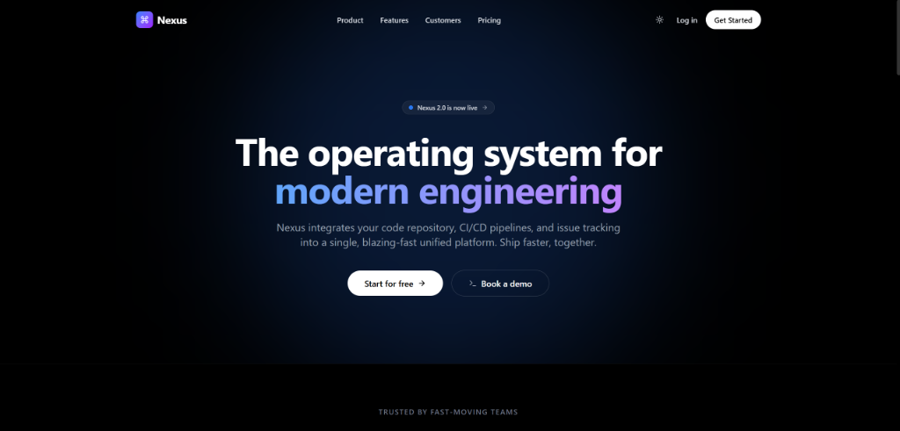

<div align="center">
  
  <h1 align="center">Nexus Landing Page</h1>
  <p align="center">
    <strong>A premium, ultra-polished landing page built for Acdyon Technologies Frontend Challenge.</strong>
  </p>
  
  <h3>🌐 Live Demo: <a href="https://acdyon-seven.vercel.app/">https://acdyon-seven.vercel.app/</a></h3>

  <p align="center">
    <a href="https://nextjs.org/"></a>
    <a href="https://tailwindcss.com/"></a>
    <a href="https://www.framer.com/motion/"></a>
    <a href="https://reactjs.org/"></a>
  </p>
</div>

<br />

[](https://acdyon-seven.vercel.app/)

<br />

<br />

## ✨ Features

Nexus is a fictional "operating system for modern engineering teams" built to demonstrate high-end UI/UX engineering.

- 🌗 **Seamless Light & Dark Mode** – Powered by `next-themes` and Tailwind v4 custom variants.
- 🎨 **Premium UI/UX** – Highly polished typography, spacing, and micro-interactions.
- 🖱️ **Dynamic Mouse Tracking** – A glowing spotlight effect that follows your cursor inside the dashboard card (visible in dark mode).
- 📱 **Fully Responsive** – Flawless execution across mobile (390px) and desktop (1440px) without horizontal scrolling.
- ⚡ **Interactive Product Demo** – A mock dashboard card built entirely in React/CSS mimicking real application tabs and states.
- 🚀 **Working Modals & Forms** – No "dead" buttons. CTAs open a beautifully animated glass-morphic modal with a mock sign-up form.
- 🎮 **Hidden Easter Egg** – Try typing the Konami Code (`↑ ↑ ↓ ↓ ← → ← → B A`) anywhere on the page!

## 🛠️ Tech Stack

- **Framework:** [Next.js 15](https://nextjs.org/) (App Router)
- **Styling:** [Tailwind CSS v4](https://tailwindcss.com/)
- **Animations:** [Framer Motion](https://www.framer.com/motion/)
- **Icons:** [Lucide React](https://lucide.dev/)
- **Themes:** `next-themes`

## 🚀 Getting Started

To run this project locally:

### 1. Clone & Install
```bash
git clone <your-repo-url>
cd premium-landing
npm install
```

### 2. Run the Development Server
```bash
npm run dev
```

Open [http://localhost:3000](http://localhost:3000) with your browser to see the result.

## 📂 Project Structure

```text
premium-landing/
├── src/
│   ├── app/
│   │   ├── globals.css        # Tailwind v4 directives & global styles
│   │   ├── layout.tsx         # Root layout with ThemeProvider
│   │   └── page.tsx           # Main assembly of the landing page
│   └── components/
│       ├── Hero.tsx           # Main hero section
│       ├── ProductDemo.tsx    # Interactive dashboard mockup
│       ├── Features.tsx       # 4-grid feature breakdown
│       ├── Pricing.tsx        # Pricing tiers with Monthly/Yearly toggle
│       ├── Customers.tsx      # Infinite scrolling marquee
│       ├── Modal.tsx          # Animated glass-morphic sign-up form
│       ├── Navbar.tsx         # Sticky nav with Theme Toggle
│       └── EasterEgg.tsx      # Konami code listener
└── DECISIONS.md               # Architectural decisions & AI usage
```

## 📝 Design Decisions

For a full breakdown of the architectural choices, trade-offs, and design methodology, please read the [DECISIONS.md](./DECISIONS.md) file included in the repository.

---

<div align="center">
  <sub>Built with ❤️ for the Acdyon Frontend Challenge.</sub>
</div>
